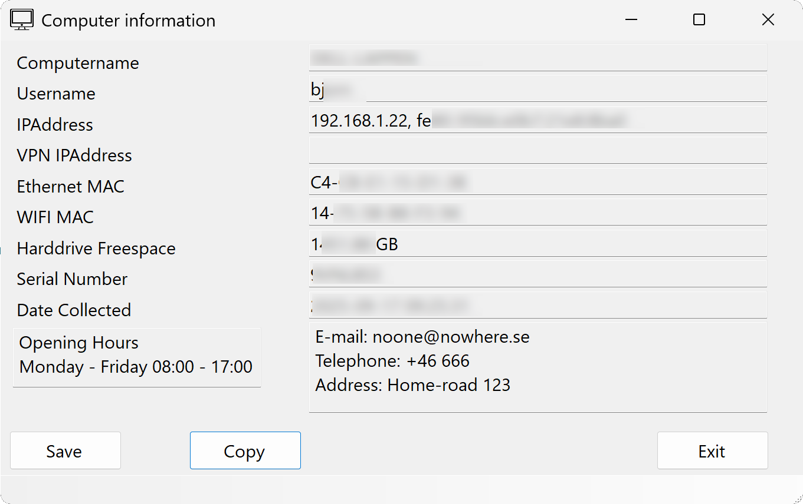

# PSComputerInfo

A toy to make it easy for support to get and add information gathering for client computers.



First line / support often wants to gather data from end user computers. Users does not want to run console commands. Support often likes to write PowerShell scripts.

This tool combines them all.

## Running the app

Download latest release, unzip, and run `ComputerInfo.exe`

> Note: Don't forget to unblock the files on first run to prevent "smart" filter issues..

```PowerShell
Set-Location .\PackageRelease\
Get-ChildItem -Recurse | Unblock-File
```

The application will automatically search the configured folder for any .ps1 files and create the gui layout from those scripts.

After scripts it will search for .txt files and add those as information boxes.

Save as txt file, copy to clipboard, and exit.. does that.

## Configuration

The software includes a configuration file named `ComputerInfo.dll.config`. This xml can be edited using any text editor of your choice and contains two settings:

- PowerShellPath
    - This setting points to the folder where the app will look for scripts and textboxes to add. Default is .\Scripts (relative to the application).
- IncludeDebugOutput
    - Normally we only set values to the script output. Set this to `True` to include all output streams to the value box. This helps a lot when debugging if your added script does not show anything valid in the value box.

## Adding or changing information

The application will search the configured `PowerShellPath` (see above) for any .ps1 and .txt files and add them to the gui. Adding or removing output is as easy as adding, removing, or changing the files in there.

Some rules apply for the files.

### PowerShell files

- _Must_ output a string. One string. It may work with other things, or more than one, but I do not guarantee it.
- The key / field title will be the filename, without prefixed numbers and file extension. for example, the filename `10.My Extra Thing.ps1` will generate a field named `My Extra Thing` with the output of the script  as value.
- If you want to sort your information order, simply start the filename with `number - dot` - for example `10.myExtraInfo.ps1`. The app will remove any numbers and dots from the beginning of the filename.

## Text files

- The contents of the .txt file will be what the info box will contain.
- The filename _MUST_ start with either `1.` or `2.`. This number tells the app in which "box" to put the information. 1 is left, 2 is right. Files without numbers will not show up.
- Sorting info boxes can be done by adding _extra_ numbers to the file name. For example: `1.3.MyInformation.txt` will put the information in box 1 (left) and as the third information box (assuming we have a 1 and 2 of course..)
- Character encoding of files may mess things up. I don't know. I only verifies it with Swedish UTF-8 files.

## About the code

It is probably ugly. It can probably be made faster and more memory safe. In fact - there may be a lot of things to improve here. I may care eventually, but not now.

- Make it work <- I am here.
- Make it beautiful
- Make it fast

It is also 100% free from AI slop. The initial design was created using the Visual studio designer tool, but most of it is rewritten by hand. This is how I learn. I also intend to keep it this way. This is just as much a learning thing as it is a useful program.
